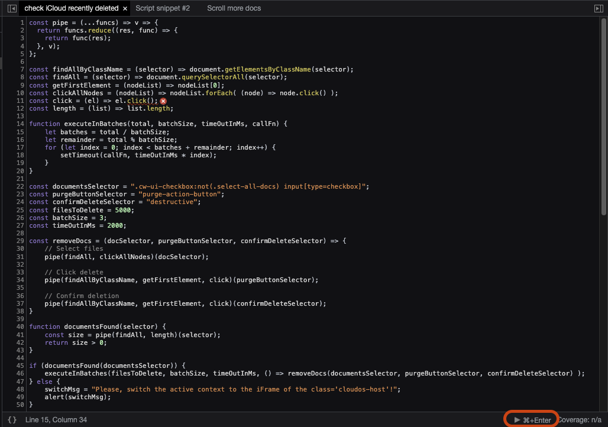

# Remove recently deleted iCloud Drive files

## Context

When you store files on iCloud Drive their deletion is delayed. After the deletion the files are placed in a hard to access Recently Deleted folder where they stay for 30 days before the final purge. This is typically a good thing.

But when the storage is full all other Apple iCloud services, be it Mail or Notes, will stop working. There are two obvious choices left: clear up the iCloud Drive and wait for 30 days *or* pay for the storage upgrade. 

The third option is to delete the files from the recently deleted folder. Alas, there is no access to it but from the web interface. And there is a bug when deleting more than a thousand files which prevents delete all files in case there is more than a 1000.


## Solution

Here is a _very crude_ solution that can help in case you need to restore access to your Apple services without paying for upgrade or waiting for the 30 days after the deletion.
 
1. Log into icloud.com. Go to the account settings. Click on recent files. Wait for the screen to load.


 
2. Prepare the script
    1. Open the Development tools of the browser
    2. Go to Sources -> Snippets -> New snippet 
    3. Copy-paste the code below
    4. Save the snippet

```javascript
const pipe = (...funcs) => v => {
  return funcs.reduce((res, func) => {
    return func(res);
  }, v);
};

const findAllByClassName = (selector) => document.getElementsByClassName(selector);
const findAll = (selector) => document.querySelectorAll(selector);
const getFirstElement = (nodeList) => nodeList[0];
const clickAllNodes = (nodeList) => nodeList.forEach( (node) => node.click() );
const click = (el) => el.click();
const length = (list) => list.length;

function executeInBatches(total, batchSize, timeOutInMs, callFn) {
    let batches = total / batchSize;
    let remainder = total % batchSize;
    for (let index = 0; index < batches + remainder; index++) {
        setTimeout(callFn, timeOutInMs * index);
    }
}

const documentsSelector = ".cw-ui-checkbox:not(.select-all-docs) input[type=checkbox]";
const purgeButtonSelector = "purge-action-button";
const confirmDeleteSelector = "destructive";
const filesToDelete = 5000;
const batchSize = 3;
const timeOutInMs = 2000;

const removeDocs = (docSelector, purgeButtonSelector, confirmDeleteSelector) => {
    // Select files
    pipe(findAll, clickAllNodes)(docSelector);
    
    // Click delete
    pipe(findAllByClassName, getFirstElement, click)(purgeButtonSelector);

    // Confirm deletion
    pipe(findAllByClassName, getFirstElement, click)(confirmDeleteSelector);
}

function documentsFound(selector) {
    const size = pipe(findAll, length)(selector);
    return size > 0;
}

if (documentsFound(documentsSelector)) {
    executeInBatches(filesToDelete, batchSize, timeOutInMs, () => removeDocs(documentsSelector, purgeButtonSelector, confirmDeleteSelector) );
} else {
    switchMsg = "Please, switch the active context to the iFrame of the class='cloudos-host'!";
    alert(switchMsg);
}
```

1. Choose the iframe for the execution context (CSS class "cloudos-host"). Clicking on it in the elemtns pane will work, too.


1. Execute the script.



## No warranties
 
Please, note that class identifiers may change in the future and the script may need to be updated. In case you find such discrepancies, please, don't hesitate to submit a fixing PR.
